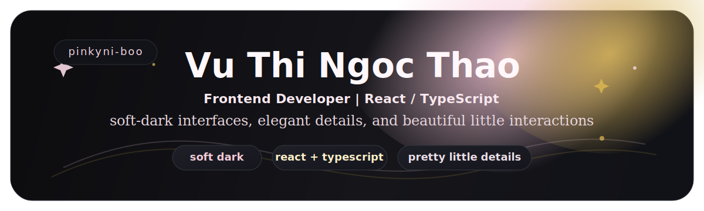
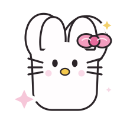
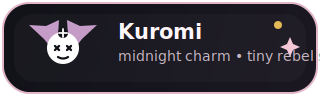
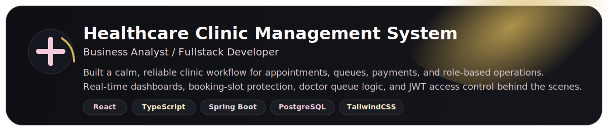
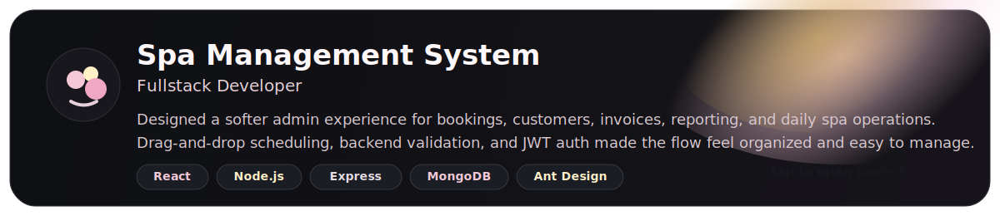

  

  
  

  tiny sticker corner: hello kitty x kuromi

  <strong>creative, detail-oriented, and a little obsessed with making UI feel soft, polished, and memorable</strong>

  
  
  

  
  

  ୨୧ ⋆｡˚ ✦ ˚｡⋆ ୨୧

<h2 align="center">About Me</h2>

  I'm Thao, a frontend developer who loves turning ideas into interfaces that feel clean, calm, and quietly beautiful.

  I care about the tiny things too: spacing, rhythm, color balance, component structure, state flow, and those little details users may never name out loud but always feel.

  If it looks soft, works smoothly, and feels thoughtfully made, that's usually the kind of work I want my name on.

  <i>"Design with tenderness, code with intention."</i>

  ୨୧ ⋆｡˚ ✦ ˚｡⋆ ୨୧

<h2 align="center">Tech Stack</h2>

  
  
  
  
  

  
  
  
  

  
  
  
  
  
  

  React, TypeScript, beautiful UI, and frontend work with a soft-dark aesthetic at heart ✨

  ୨୧ ⋆｡˚ ✦ ˚｡⋆ ୨୧

<h2 align="center">Featured Projects</h2>

  

  

  

  
  

  ୨୧ ⋆｡˚ ✦ ˚｡⋆ ୨୧

<h2 align="center">GitHub Garden</h2>

  
  

  

  ୨୧ ⋆｡˚ ✦ ˚｡⋆ ୨୧

<h2 align="center">Let's Connect</h2>

  

  
  

  open to thoughtful frontend work, lovely UI details, and cozy modern product experiences 💖

